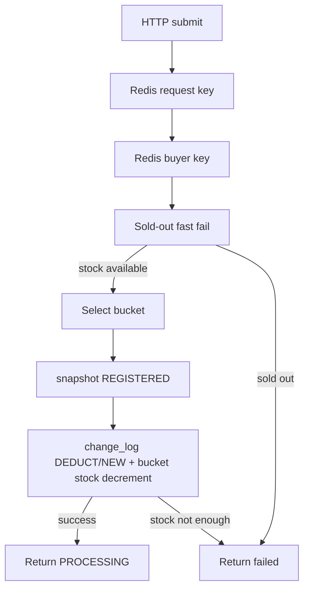

# 当前秒杀链路架构流程图

## 目录

- [1. 当前定位](#1-当前定位)
- [2. 当前运行态开关](#2-当前运行态开关)
- [3. 秒杀入口异步化](#3-秒杀入口异步化)
- [4. 提交主链路](#4-提交主链路)
- [5. 库存事实和订单 outbox](#5-库存事实和订单-outbox)
- [6. 结果闭环](#6-结果闭环)
- [7. 后台治理能力](#7-后台治理能力)
- [8. 压测和验收口径](#8-压测和验收口径)
- [9. 当前关键结论](#9-当前关键结论)
- [10. 代码锚点](#10-代码锚点)

## 1. 当前定位

当前秒杀主链路是：

```text
OceanBase 分桶分片库存 + snapshot/change_log 事实表
秒杀侧 outbox + RabbitMQ
MySQL 正式订单
订单结果消息回写 OceanBase
```

`mall-seckill` 的 HTTP 提交入口不再维护旧同步资格路径，也不再同步创建 `seckill.order.create` outbox。提交线程只完成快速挡重、snapshot 登记、业务桶扣减和 change_log 扣减事实记录，然后返回 `PROCESSING`。

正式建单仍由 `mall-order` 异步完成。订单结果消息回到 `mall-seckill` 后，`SeckillResultMessageListener` 以 `seckill_stock_snapshot` 和 `seckill_stock_change_log` 为事实源关闭 `seckill_result`。

## 2. 当前运行态开关

`stage3c-sharding` 的关键开关：

```properties
mall.seckill.bucket.enabled=true
mall.seckill.stock-cache.enabled=true
mall.seckill.stock-cache.repair.enabled=true
mall.seckill.entry-guard.enabled=true
mall.seckill.order-outbox.enabled=true
mall.seckill.snapshot-repair.enabled=true
mall.seckill.result-retry.enabled=true
mall.seckill.bucket.center-ledger.enabled=true
mall.seckill.bucket.transfer.enabled=true
mall.seckill.bucket.auto-transfer.enabled=true
mall.seckill.bucket.availability.enabled=true
mall.seckill.bucket.reconcile.enabled=false
```

含义：

- `entry-guard.enabled=true`：入口使用 Redis request/buyer key 做快速幂等和同买家挡重。
- `order-outbox.enabled=true`：`seckill.order.create` 消息由后台 worker 根据库存扣减事实生成。
- `snapshot-repair.enabled=true`：无扣减事实的 stale `REGISTERED` snapshot 会被修复为失败结果。

## 3. 秒杀入口异步化

入口异步化后的边界是：

- 提交入口不再执行旧同步资格路径。
- 提交入口不再同步调用 `ReliableMessagePublisher.enqueueSeckillOrderCreate`。
- 入口只做 Redis 快速挡重、`seckill_stock_snapshot` 请求登记、`seckill_stock_change_log` 库存扣减事实和 `seckill_stock_bucket` 条件扣减。
- HTTP 返回 `PROCESSING`，最终成功只以 `seckill_result.SUCCESS` 为准。

后台由 `SeckillOrderOutboxFromChangeLogJob` 消费 `seckill_stock_change_log.status = NEW`，为正式 `DEDUCT` 库存事实生成 `seckill.order.create` outbox，并将流水推进为 `OUTBOXED`。中心账本消费者在 async outbox 模式下消费 `OUTBOXED`，应用完成后推进为 `APPLIED`。

## 4. 提交主链路

入口 API：

```text
POST /api/seckill/{activityId}/{skuId}
GET  /api/seckill/result/{requestId}
```

提交流程：

1. `SeckillController.submit` 进入秒杀提交。
2. `SeckillHotspotGuard`、Sentinel、可选 `SeckillEntryGuard.acquireRequest` 拦截明显重复请求。
3. 售罄快速失败在 request/buyer key 之后、bucket 选择之前执行；命中时释放 buyer key 并返回库存不足。
4. `SeckillEntryGuard.acquireBuyer` 拦截同买家并发提交。
5. `SeckillBucketService.selectBucket` 选择业务桶。
6. `SeckillRepository.registerBucketSnapshot` 写 `seckill_stock_snapshot(status=REGISTERED)`。
7. `SeckillRepository.recordBucketDeductionFact` 条件扣减业务桶库存并写 `seckill_stock_change_log(status=NEW, change_type=DEDUCT)`。
8. HTTP 返回 `PROCESSING`；没有同步订单 outbox。



提交线程不调用 `ReliableMessagePublisher.enqueueSeckillOrderCreate`。建单消息由后台 outbox worker 根据 `change_log` 补生成。

## 5. 库存事实和订单 outbox

库存侧有三类核心事实：

- `seckill_stock_snapshot`：请求级 reservation 事实。入口先写 `REGISTERED`，订单结果到达后进入 `CONFIRMED` 或 `RELEASED`；无法落扣减事实的 stale `REGISTERED` 会由 snapshot repair 原子标为 `FAILED`。
- `seckill_stock_change_log`：库存变更事实。正式扣减写 `DEDUCT/NEW`；order outbox worker claim 后进入 `OUTBOXING`，完成建单 outbox 后进入 `OUTBOXED`；中心账本处理中进入 `LEDGER_PROCESSING`，完成后进入 `APPLIED`。
- `mq_message`：秒杀侧可靠消息 outbox。当前 `seckill.order.create` 由 `SeckillOrderOutboxFromChangeLogJob` 后台生成，不在 submit 事务内生成。

`SeckillOrderOutboxFromChangeLogService` 对每条 change_log 使用 shard-aware CAS：

```text
NEW -> OUTBOXING -> OUTBOXED
```

可重试异常保持 `OUTBOXING`，由 stale reset 拉回 `NEW` 后重试；只有确定性坏账，如 blank `requestId`，才进入 `OUTBOX_FAILED`。

`SeckillCenterBucketLedgerConsumer` 在 `order-outbox.enabled=true` 时消费 `OUTBOXED`，避免和 outbox worker 抢 `NEW`。如果配置回滚到 `order-outbox.enabled=false`，consumer 会先兜底消费遗留 `OUTBOXED`，再消费 legacy `NEW`。

## 6. 结果闭环

`mall-order` 消费 `seckill.order.create`，在 MySQL 创建正式订单，然后发送 `seckill.order.result`。结果消息主要状态：

- `SUCCESS`：`confirmDeduction`。`DEDUCTED` snapshot 可确认；`REGISTERED + 当前 shard 存在 DEDUCT change_log` 也可确认。
- `FAILED`：`releaseDeduction`。`DEDUCTED` snapshot 可释放；`REGISTERED + 当前 shard 存在 DEDUCT change_log` 也可释放。
- `CANCELED`、`ORDER_CLOSED`、`ORDER_CANCELED`：`releaseConfirmedDeduction`，只释放已确认订单对应的 `CONFIRMED` snapshot。

查询结果以 `seckill_result` 为准。入口返回 `PROCESSING` 后，只有结果消息或 repair 任务会关闭最终状态。

## 7. 后台治理能力

- `SeckillOrderOutboxFromChangeLogJob`：从 `change_log.NEW` 生成 `seckill.order.create` outbox。
- `SeckillCenterBucketLedgerConsumer` / `SeckillCenterBucketLedgerApplier`：中心桶异步总账。
- `SeckillSnapshotFactRepairJob`：扫描 stale `REGISTERED` snapshot；当前 shard 没有 `DEDUCT` fact 时，通过 repository 事务方法原子标失败并写 `FAILED` result。
- `SeckillStockCacheRepairJob`：追平 TairString/Redis 版本缓存。
- `SeckillBucketTransferService`：请求触发调拨。
- `SeckillBucketAutoTransferService`：后台自动调拨。
- `SeckillBucketAvailabilityCoordinator`：合并业务桶空/可用信号，重建可用桶缓存。
- `SeckillResultRetryRepository`：结果消费失败后的延迟重试和最大次数兜底。
- `MessageCompensationJob`：按配置的 `bucket_shard_key` 分片扫描 reliable-message 补偿和 dispatching timeout，避免 OceanBase 分库场景下的 multi-node `UPDATE ... LIMIT`。

## 8. 压测和验收口径

异步入口验收看四类指标：

- HTTP 提交可以快速返回 `PROCESSING`，入口不再同步创建订单消息。
- `seckill_stock_snapshot` 从 `REGISTERED` 开始，最终闭合到 `CONFIRMED`、`RELEASED` 或 `FAILED`。
- `seckill_stock_change_log` 能从 `NEW` 推进到 `OUTBOXED`、`APPLIED`。
- MySQL 正式订单数、OceanBase snapshot/result、库存扣减事实一致；无重复订单、无重复 requestId 成功。

已知执行事实：

- `target/loadtest` 是未跟踪目录，执行 `mvn clean package` 后会被清理。
- 当前仓库没有可恢复的 `run-stage3c-smoke.ps1` 脚本；已有运行态压测脚本在 clean 后不再存在。
- 因此本分支最终以自动化单元/集成测试和 package 结果作为可复现验收，运行态 load test 需要重新提供脚本后再执行。

## 9. 当前关键结论

- 旧同步资格路径 / 同步 order outbox submit 路径已从 `SeckillServiceImpl` 去除。
- async entry guard 未启用时直接拒绝提交，不回退旧同步路径。
- 售罄快速失败仍保留，并且在失败时释放 buyer key。
- order outbox worker 是生成 `seckill.order.create` 的唯一当前生产路径。
- reliable-message 补偿和 timeout 标记需要按 `bucket_shard_key` 路由。

## 10. 代码锚点

| 主题 | 文件 | 说明 |
| --- | --- | --- |
| 提交入口 | `mall-seckill/src/main/java/com/mall/seckill/service/impl/SeckillServiceImpl.java` | async entry hot path |
| Redis 入口 guard | `mall-seckill/src/main/java/com/mall/seckill/service/impl/SeckillEntryGuard.java` | request/buyer key |
| 库存事实 repository | `mall-seckill/src/main/java/com/mall/seckill/mapper/SeckillRepository.java` | snapshot/change_log |
| outbox worker | `mall-seckill/src/main/java/com/mall/seckill/service/impl/SeckillOrderOutboxFromChangeLogService.java` | change_log -> order outbox |
| center ledger | `mall-seckill/src/main/java/com/mall/seckill/service/impl/SeckillCenterBucketLedgerConsumer.java` | OUTBOXED -> APPLIED |
| result listener | `mall-seckill/src/main/java/com/mall/seckill/service/impl/SeckillResultMessageListener.java` | 订单结果闭环 |
| snapshot repair | `mall-seckill/src/main/java/com/mall/seckill/service/impl/SeckillSnapshotFactRepairJob.java` | stale REGISTERED 修复 |
| reliable message | `mall-message/src/main/java/com/mall/message/MessageCompensationJob.java` | shard-aware 补偿 |

## 11. 2026-07-10 验证补充

- 当前 outbox 主路径已经切到 `AFTER_COMMIT -> SeckillDeductCommittedListener -> SeckillOrderOutboxCoordinator -> drainShard`。
- `SeckillOrderOutboxFromChangeLogJob` 现在只负责 stale `OUTBOXING` 恢复 signal，不再直接处理业务 SQL。
- 已新增秒杀专用 `SeckillOrderCreateMessageCompensationJob`，每秒只补偿 `seckill.order.create` 的 `NEW/FAILED`。
- 2026-07-10 本地入口压测已通过：`target/loadtest/stage3c-current/submit-20260710-184930.jtl`，`18105` 请求，约 `301 req/s`，JMeter 错误 `0%`。
- 同轮闭合未通过，根因不是入口回归，而是运行中的 OceanBase 分片库未执行 `migration-v14-seckill-outbox-direct-drain.sql`，导致 `mall-seckill` 日志报 `Unknown column 'outbox_claim_token'`。
- 补执行 v14 后，又发现 `scripts/loadtest/stage3c/reset-seckill-loadtest.ps1` 在大量 Redis key 场景下会因 `redis-cli DEL` 参数过长失败，需先修 reset 脚本后再做迁移后的 clean rerun。
