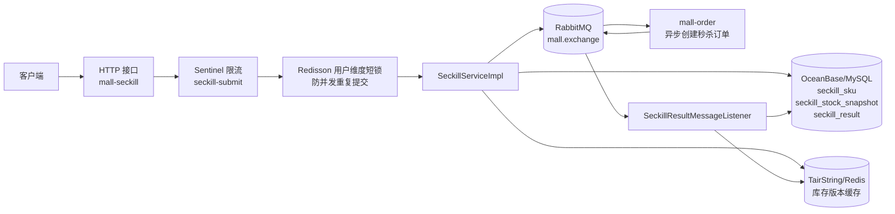
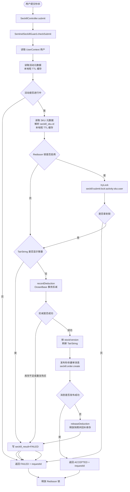
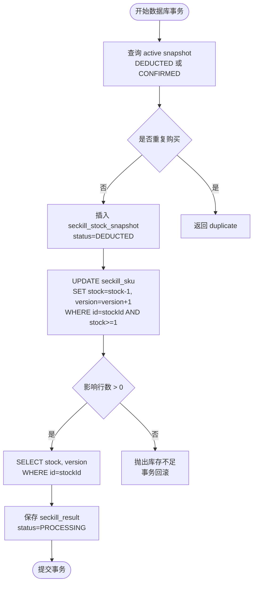
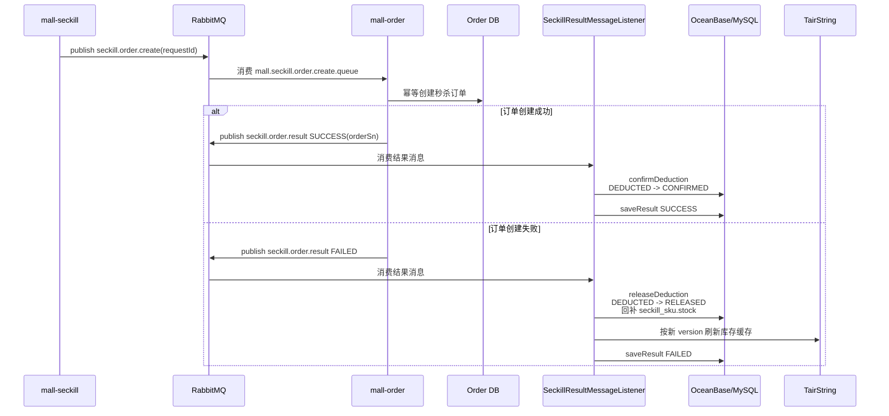
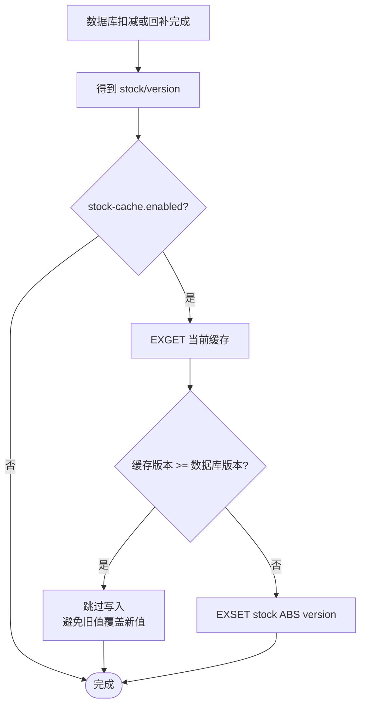
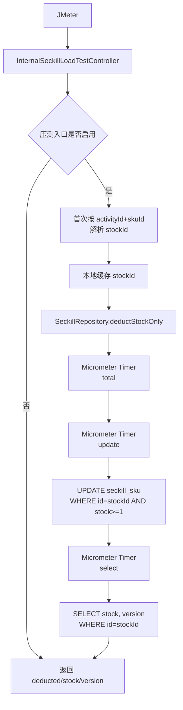

# 当前秒杀链路架构流程图

## 目录

- [1. 当前定位](#1-当前定位)
- [2. 总体架构](#2-总体架构)
- [3. 秒杀提交主链路](#3-秒杀提交主链路)
- [4. OceanBase 事务扣减](#4-oceanbase-事务扣减)
- [5. 异步建单和结果回传](#5-异步建单和结果回传)
- [6. 库存缓存链路](#6-库存缓存链路)
- [7. stock-only 压测链路](#7-stock-only-压测链路)
- [8. 当前关键结论](#8-当前关键结论)
- [9. 代码锚点](#9-代码锚点)

## 1. 当前定位

当前 `mall-seckill` 已经不是“Redis 信号量作为最终库存”的模型。

现状更接近文档阶段一：

- OceanBase/MySQL 表 `seckill_sku` 是库存事实源。
- HTTP 秒杀提交链路同步执行库存扣减和快照账本写入。
- TairString/Redis 只做库存缓存和售罄快速失败，不作为最终库存账本。
- RabbitMQ 只负责异步创建订单和结果回传。
- `seckill_stock_snapshot` 解释每一次扣减、确认和释放。

当前实现和阶段一文档的主要差异：

- 文档里的 `LOGIC_UPDATE` 是概念化热点行更新，本项目实际用 MyBatis 执行 `UPDATE + SELECT`。
- 文档阶段一按库存行主键更新；当前正式链路已经解析并传入 `seckill_sku.id`，扣减 SQL 使用 `WHERE id = ?`。
- TairString 版本写缓存已经落地，但它是缓存一致性优化，不是库存扣减前置准入。

## 2. 总体架构



## 3. 秒杀提交主链路

入口：

```text
POST /api/seckill/{activityId}/{skuId}
```

返回语义：

- 同步返回 `requestId` 和 `ACCEPTED/FAILED`。
- 订单是否最终创建成功，需要查询结果接口：

```text
GET /api/seckill/result/{requestId}
```

流程图：



说明：

- Redisson 锁只保护同一用户、同一活动、同一 SKU 的并发重复提交。
- 真正的重复购买判断仍在数据库事务内通过 `seckill_stock_snapshot` 状态判断。
- TairString 售罄判断是快速失败。缓存异常时会降级为继续访问数据库。
- 库存扣减成功后，订单创建还未完成，所以 HTTP 返回 `ACCEPTED`。

## 4. OceanBase 事务扣减

核心方法：

```text
SeckillRepository.recordDeduction(requestId, stockId, activityId, skuId, userId, quantity)
```

当前事务内做三件事：

1. 写扣减快照。
2. 按主键扣减 `seckill_sku.stock` 并递增 `version`。
3. 写 `seckill_result=PROCESSING`。

流程图：



关键点：

- `seckill_sku.id` 是库存行主键，压测前已验证 `WHERE id = ?` 不再走二级索引回表。
- `version` 每次库存变更递增，用来保护 TairString 缓存不被旧版本覆盖。
- 如果库存不足，快照插入会随事务回滚。

## 5. 异步建单和结果回传

建单消息：

```text
exchange: mall.exchange
routingKey: seckill.order.create
queue: mall.seckill.order.create.queue
```

结果消息：

```text
exchange: mall.exchange
routingKey: seckill.order.result
queue: mall.seckill.order.result.queue
```

流程图：



异常路径：

- `mall-seckill` 发布建单消息失败：立即执行 `releaseDeduction`，回补库存，保存 `FAILED`。
- `mall-order` 消费建单失败：会发布失败结果消息，然后当前消息 `basicNack`。队列配置了死信队列，最终失败消息进入 DLQ。
- `mall-seckill` 消费结果失败：`basicNack(requeue=false)`，结果消息进入结果 DLQ。

## 6. 库存缓存链路

缓存 key：

```text
seckill:stock-cache:{activityId}:{skuId}
```

缓存写入：

```text
EXSET key stock ABS version
```

当前代码通过 Lua 包装 TairString：

- `EXGET` 读取当前 `value/version`。
- 如果已有版本大于等于新版本，则拒绝覆盖。
- 如果新版本更新，则执行 `EXSET ... ABS version`。

流程图：



缓存定位：

- 它不是库存事实源。
- 它用于售罄快速失败和读优化。
- 写缓存失败不会回滚数据库事务。

## 7. stock-only 压测链路

入口：

```text
POST /internal/seckill/loadtest/stock-deduct/{activityId}/{skuId}
```

启用条件：

```text
mall.seckill.load-test.stock-deduct-enabled=true
```

流程图：



和正式秒杀提交链路的区别：

- 不走 Sentinel。
- 不走 Redisson。
- 不写 `seckill_stock_snapshot`。
- 不写 `seckill_result`。
- 不刷新 TairString。
- 不发 RabbitMQ。
- 只测 `HTTP + Spring MVC + MyBatis + OceanBase 热点行 UPDATE + SELECT`。

因此，最近 `docs/performance-testing.md` 中的 stock-only QPS 只能代表库存扣减主链路压测结果，不能代表完整秒杀业务链路吞吐。

## 8. 当前关键结论

当前链路可以概括为：

```text
同步定资格和扣库存，异步建订单，结果回传做最终确认或释放。
```

更细一点：

- 秒杀成功的即时证明是 `requestId + ACCEPTED`，不是订单号。
- 订单号由 `mall-order` 异步创建后通过结果消息回传。
- `seckill_sku.stock` 已经在 HTTP 提交事务内同步扣减。
- 如果异步建单失败，会通过 `releaseDeduction` 把库存回补。
- 如果用户查询结果时还没有结果记录，接口会返回 `PROCESSING`。

当前主要性能瓶颈：

- stock-only 阶梯压测显示，`100 -> 150` 并发开始出现明显收益骤降。
- `update` Timer 基本等于 `total` Timer，说明应用线程主要耗时集中在等待热点行 `UPDATE` 调用返回；这里包含数据库热点行排队，并不等同于 OceanBase 裸 SQL 执行耗时。
- `select` 通常是个位到十几毫秒，不是当前主瓶颈。
- `1000` 并发档出现 JMeter 客户端 `Address already in use`，不能直接视为服务端上限。

正式链路新增分段指标：

| 指标 | 含义 |
| --- | --- |
| `seckill.submit.total` | 正式提交入口总耗时 |
| `seckill.submit.sentinel` | Sentinel 入口保护耗时 |
| `seckill.submit.metadata` | 活动和 SKU 元数据读取耗时 |
| `seckill.submit.lock` | Redisson 用户重复提交锁耗时 |
| `seckill.submit.stock-cache.sold-out` | TairString 售罄快速失败判断耗时 |
| `seckill.submit.record.total` | 库存扣减事务总耗时 |
| `seckill.submit.record.duplicate` | 重复购买账本检查耗时 |
| `seckill.submit.record.snapshot.insert` | 扣减快照写入耗时 |
| `seckill.submit.record.stock.update` | 主键库存扣减 `UPDATE` 耗时 |
| `seckill.submit.record.stock.select` | 扣减后 `stock/version` 查询耗时 |
| `seckill.submit.result.save` | 结果表写入或更新耗时 |
| `seckill.submit.stock-cache.refresh` | TairString 版本缓存刷新耗时 |
| `seckill.submit.mq.publish` | RabbitMQ 建单消息发布耗时 |
| `seckill.submit.release.*` | MQ 发布失败等补偿释放路径耗时 |

正式链路压测脚本：

```powershell
& "C:\Program Files\apache-jmeter-5.6.3\bin\jmeter.bat" `
  -n `
  -t docs/jmeter/seckill-submit.jmx `
  -Jhost=localhost `
  -Jport=8105 `
  -JactivityId=1 `
  -JskuId=1001 `
  -Jthreads=100 `
  -Jloops=10 `
  -Jramp=2 `
  -JuserIdStart=1000000 `
  -l target/loadtest/jmeter-seckill-submit.jtl `
  -e `
  -o target/loadtest/jmeter-report-seckill-submit
```

## 9. 代码锚点

| 模块 | 文件 | 说明 |
| --- | --- | --- |
| 秒杀 HTTP 入口 | `mall-seckill/src/main/java/com/mall/seckill/controller/SeckillController.java` | 活动列表、秒杀提交、结果查询 |
| 提交流程编排 | `mall-seckill/src/main/java/com/mall/seckill/service/impl/SeckillServiceImpl.java` | Sentinel、Redisson、扣减、缓存刷新、MQ 发布 |
| 库存事务账本 | `mall-seckill/src/main/java/com/mall/seckill/mapper/SeckillRepository.java` | `recordDeduction`、`confirmDeduction`、`releaseDeduction`、stock-only |
| 库存 SQL | `mall-seckill/src/main/java/com/mall/seckill/mapper/SeckillSkuMapper.java` | 主键扣减、版本查询、回补 |
| TairString 缓存 | `mall-seckill/src/main/java/com/mall/seckill/cache/SeckillStockCache.java` | 售罄快速失败、版本缓存刷新 |
| TairString 命令 | `mall-seckill/src/main/java/com/mall/seckill/cache/RedisTairStringCommands.java` | `EXGET/EXSET` Lua 包装 |
| 结果消费 | `mall-seckill/src/main/java/com/mall/seckill/service/impl/SeckillResultMessageListener.java` | 消费订单结果并确认或释放快照 |
| 建单消费 | `mall-order/src/main/java/com/mall/order/service/impl/OrderMessageListener.java` | 消费秒杀建单消息并回传结果 |
| 秒杀订单创建 | `mall-order/src/main/java/com/mall/order/service/impl/OrderServiceImpl.java` | 幂等创建秒杀订单 |
| 消息常量 | `mall-message/src/main/java/com/mall/message/MessageNames.java` | exchange、queue、routing key |
| 可靠消息发布 | `mall-message/src/main/java/com/mall/message/ReliableMessagePublisher.java` | 保存消息、发送 MQ、confirm/return 回调 |
