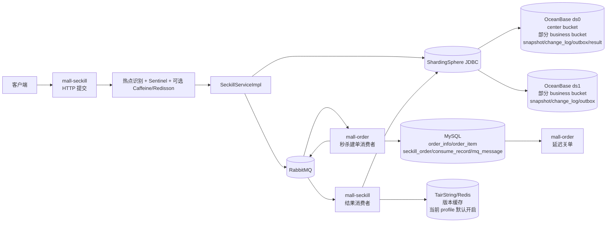
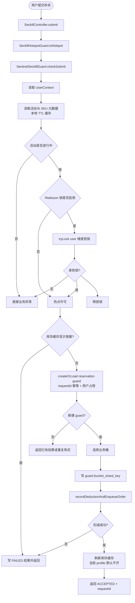
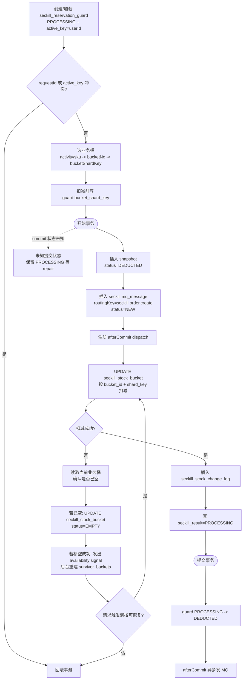

# 当前秒杀链路架构流程图

## 目录

- [1. 当前定位](#1-当前定位)
- [2. 当前运行态开关](#2-当前运行态开关)
- [3. 总体架构](#3-总体架构)
- [4. 秒杀提交主链路](#4-秒杀提交主链路)
- [5. OceanBase 分桶分片事务](#5-oceanbase-分桶分片事务)
- [6. 异步建单和结果回传](#6-异步建单和结果回传)
- [7. 后台治理能力](#7-后台治理能力)
- [8. 缓存和保护开关](#8-缓存和保护开关)
- [9. 压测入口和结果口径](#9-压测入口和结果口径)
- [10. 当前关键结论](#10-当前关键结论)
- [11. 代码锚点](#11-代码锚点)

## 1. 当前定位


现在真实运行的秒杀主架构是：

```text
OceanBase 分桶分片库存 + OceanBase reservation/outbox + RabbitMQ +
MySQL 正式订单 + 结果消息回写 OceanBase
```

更准确一点：

- `mall-seckill` 负责同步创建全局 reservation guard、选桶后提前持久化 `bucket_shard_key`、扣业务桶库存、写 reservation 账本、写建单 outbox。
- `mall-order` 负责异步创建正式订单，订单事实表存放在 MySQL。
- `mall-seckill` 再消费订单结果消息，把 reservation 从 `DEDUCTED` 推进到 `CONFIRMED`，或在失败/关单时推进到 `RELEASED` 并回补库存。

当前实现里：

- `requestId` 是请求幂等号，也是 C 端查询结果的主键；HTTP 提交可通过 `X-Request-Id` 传入，不传则服务端生成。
- `reservationId` 是订单侧和库存侧对同一笔秒杀资格的统一凭证。
- 当前代码里 `reservationId` 默认直接复用规范化后的 `requestId`。

## 2. 当前运行态开关

下面这组状态描述的是当前压测脚本实际启动的运行态，不是“代码里是否支持”。

`mall-seckill` 当前使用 `stage3c-sharding` profile：

- `bucket.enabled = true`
- `routing.physicalShardCount = 2`
- `hot-path-aggregate-read = false`
- `lock.enabled = false`
- `stock-cache.enabled = true`
- `stock-cache.repair.enabled = true`
- `reservation-guard.enabled = true`
- `result-retry.enabled = true`
- `bucket.center-ledger.enabled = true`
- `bucket.transfer.enabled = true`
- `bucket.transfer.max-attempts = 1`
- `bucket.auto-transfer.enabled = true`
- `bucket.availability.enabled = true`
- `bucket.reconcile.enabled = false`

`mall-order` 当前使用 MySQL 本地订单库：

- `spring.datasource.url = jdbc:mysql://localhost:3307/mall`
- 秒杀建单消费者并发：`8~16`
- 秒杀结果消息由订单服务本地 outbox 异步投递

所以要区分两层含义：

- 代码能力：已经实现了中心桶总账、自动调拨、调拨兜底、碎片整理等组件。
- 当前运行态：中心总账、请求触发调拨、自动调拨已经纳入 `stage3c-sharding` 默认态；当前默认关闭的是用户维度 Redisson 提交短锁和 `reconcile`。

## 3. 总体架构



表职责可以概括成：

- OceanBase：
  - `seckill_reservation_guard`：全局资格 guard，当前作为 ShardingSphere single table 固定在 `ds_0`
  - `seckill_stock_bucket`：业务桶和中心桶
  - `seckill_stock_snapshot`：reservation 账本
  - `seckill_stock_change_log`：库存变更日志
  - `mq_message`：秒杀侧建单 outbox
  - `seckill_result`：结果查询视图
  - `seckill_result_retry`：订单结果消费失败后的延迟重试/最终 DLQ 记录
- MySQL：
  - `order_info / order_item`：正式订单
  - `seckill_order`：reservation 与订单号绑定
  - `consume_record`：消费幂等
  - `mq_message`：订单侧结果消息 outbox、延迟关单 outbox

## 4. 秒杀提交主链路

入口：

```text
POST /api/seckill/{activityId}/{skuId}
```

可选请求头：

```text
X-Request-Id: <client-idempotency-key>
```

结果查询：

```text
GET /api/seckill/result/{requestId}
```

返回语义：

- 活动未开始、限流、未拿到重复提交锁等前置失败，直接返回业务异常，不进入 `requestId` 查询闭环。
- 同一个 `X-Request-Id` 重复提交时，返回上一次 reservation 的处理结果，不重新扣减。
- 同一用户已有进行中或已成功的 guard 时，返回重复购买语义，不重新分桶或扣库存。
- 同步返回 `ACCEPTED + requestId` 只表示 reservation 已成功落库并进入异步建单，不等价于“正式订单已创建”。
- 最终是否成功，要看 `GET /api/seckill/result/{requestId}`。



说明：

- 热点保护、Sentinel、Redisson 锁都还在代码里。
- 当前 `stage3c-sharding` profile 下 `lock.enabled=false`，所以运行时不会进入用户维度 Redisson 提交短锁。
- 当前 `stage3c-sharding` profile 下 `stock-cache.enabled=true`，提交入口会先读 Redis/TairString 做售罄快速失败；但因为 `hot-path-aggregate-read=false`，成功扣减后的版本缓存通常不在热路径同步刷新，而是依赖预热、回补路径和 `SeckillStockCacheRepairJob` 追平。
- `SeckillHotspotGuard` 当前用 `Caffeine` 本地缓存每个热点 SKU 的 `Semaphore` 门闸；只有显式打开 `mall.seckill.hotspot.enabled=true` 时才生效。
- 当前 profile 开启 `reservation-guard.enabled=true`，真正的重复购买判断以 `seckill_reservation_guard(activity_id, active_key)` 为准；该表当前固定在 `ds_0`，避免分片内唯一索引误当全局唯一。
- `bucket_shard_key` 在选桶后、扣减前写入 guard，repair 可以据此定位库存分片。
- snapshot/outbox/change_log/result 落库和业务桶扣减是同一事务。
- 秒杀提交在事务扣减阶段对瞬时数据库异常有最多 `3` 次重试和退避，只对 `TransientDataAccessException`、`SQLTransientException`、死锁类错误生效。

## 5. OceanBase 分桶分片事务

核心方法：

```text
SeckillServiceImpl.doSubmitWithReservationGuard(...)
ReservationGuardRepository.createOrLoad(...)
ReservationGuardRepository.attachBucket(...)
SeckillRepository.recordDeduction(...)
```

当前 `bucket.enabled=true` 时，事务内做的是“业务桶扣减”，不是单行 `seckill_sku.stock` 条件更新。

主流程：

1. `ReservationGuardRepository.createOrLoad(...)` 先插入 `seckill_reservation_guard(status=PROCESSING, active_key=userId)`。
2. 如果 `requestId` 已存在，直接返回上一次请求的结果。
3. 如果 `(activity_id, active_key)` 已存在，直接返回重复购买或已购买语义。
4. 通过 `SeckillBucketService.selectBucket(activityId, skuId)` 选择可扣减业务桶。
5. 扣减前调用 `attachBucket(...)`，把 `bucket_id/bucket_no/bucket_shard_key` 持久化到 guard。
6. 进入 `SeckillRepository.recordDeduction(...)` 事务，插入 `seckill_stock_snapshot(status=DEDUCTED)`。
7. 同一事务内写秒杀侧建单 outbox `mq_message(status=NEW)`、扣减业务桶、写 `seckill_stock_change_log`、写 `seckill_result=PROCESSING`。
8. 如果当前业务桶条件扣减返回 0，会查询该桶实际库存；若 `saleable_quantity <= 0`，则把业务桶条件标记为 `EMPTY`，并向 `SeckillBucketAvailabilityCoordinator` 发出可能已空信号。
9. 如果请求触发调拨可用，目标桶被打空时会尝试调拨后再扣减；无法恢复时才按库存不足回滚。
10. 事务提交后注册的 `afterCommit` 异步投递 RabbitMQ；扣减成功后 guard 从 `PROCESSING` CAS 到 `DEDUCTED`。
11. 如果能证明扣减事务未提交，guard 可从 `PROCESSING` CAS 到 `FAILED` 并释放 `active_key`；如果事务状态未知，保留 `PROCESSING`，交给 repair 判定。



### 5.1 分桶模型

当前库存模型有两类桶：

- `CENTER` 桶：总账桶，`bucket_no = 0`
- `BUCKET` 桶：前台实际扣减的业务桶

当前真实扣减只打到 `BUCKET` 桶。

业务桶选择依赖 `seckill_bucket_config.survivor_buckets`：

- `SeckillBucketService.selectBucket(...)` 先读取当前活动和 SKU 的 survivor 列表，再从存活业务桶里选择 `bucket_no`。
- `survivor_buckets` 是最终一致的选桶索引，不是库存事实源；真实库存事实源仍是 `seckill_stock_bucket.status` 和 `seckill_stock_bucket.saleable_quantity`。
- 当某个业务桶被打空时，请求线程只负责把 `seckill_stock_bucket` 条件标记为 `EMPTY`，并向 `SeckillBucketAvailabilityCoordinator` 发出可能已空信号。
- 协调器按 `(activityId, skuId)` 合并信号，延迟短窗口后调用 `SeckillBucketReconcileService`，基于真实业务桶状态重建 survivor 列表。
- 即使 survivor 短时间包含过期桶，选桶 SQL 仍通过 `status='ACTIVE' AND saleable_quantity > 0` 校验真实桶状态；本机短 TTL exhausted-bucket 缓存会减少尾段重复命中空桶。

### 5.2 分片模型

当前秒杀侧使用 ShardingSphere JDBC，把 OceanBase 拆成两个物理分片：

- `ds0 = mall-oceanbase-ce`
- `ds1 = mall-oceanbase-ce-shard1`

当前业务路由键是 `bucket_shard_key`，它会贯穿：

- `seckill_stock_bucket.shard_key`
- `seckill_stock_snapshot.bucket_shard_key`
- `seckill_stock_change_log.bucket_shard_key`
- 秒杀侧 `mq_message.bucket_shard_key`
- 订单结果消息 header / payload

但 `seckill_reservation_guard` 不是按 `bucket_shard_key` 分片的库存事实表。当前 ShardingSphere 配置把它作为 single table 放在 `ds_0.seckill_reservation_guard`，从而让这些唯一约束具有全局语义：

- `uk_guard_reservation(reservation_id)`
- `uk_guard_request(request_id)`
- `uk_guard_activity_active(activity_id, active_key)`

当前 profile 下：

- `physicalShardCount = 2`
- `bucketShardKeys = 1..16`

文档上可以把它理解成：

```text
业务桶先按 bucket_no 选桶，再由 bucket_shard_key 路由到 ds0/ds1
```

### 5.3 reservation guard

`seckill_reservation_guard` 是“一个用户只能买一次”和 request 幂等的第一道事实源：

- `PROCESSING`：guard 已创建，可能还没扣库存，也可能扣减事务状态未知。
- `DEDUCTED`：扣减事务已知成功，等待订单结果。
- `CONFIRMED`：正式订单已创建，`active_key` 继续保留，防止成功后重复购买。
- `FAILED`：可以证明未扣库存，释放 `active_key`。
- `RELEASED`：扣减后因为建单失败或订单关闭完成回补，释放 `active_key`。

guard 状态推进都走 CAS：

- `PROCESSING -> DEDUCTED`
- `PROCESSING -> FAILED`
- `PROCESSING/DEDUCTED -> CONFIRMED`
- `DEDUCTED -> RELEASED`
- `CONFIRMED -> RELEASED`

关键约束是：不能把事务状态未知的 guard 一律改成 `FAILED`，否则可能释放一个实际已经扣减成功的用户资格。状态未知时保留 `PROCESSING`，让 repair 按 `bucket_shard_key` 和库存事实判断。

### 5.4 stock snapshot 账本

`seckill_stock_snapshot` 记录库存侧 reservation 事实：

- `DEDUCTED`：业务桶已扣减，等待正式订单结果。
- `CONFIRMED`：正式订单已创建。
- `RELEASED`：建单失败或关单后库存已回补。

当前代码允许：

- 建单成功：`DEDUCTED -> CONFIRMED`
- 建单失败：`DEDUCTED -> RELEASED`
- 订单关闭/取消：`CONFIRMED -> RELEASED`

`releaseDeduction(...)` 只释放 `DEDUCTED`；`releaseConfirmedDeduction(...)` 只释放 `CONFIRMED`。这条边界用来避免“失败消息乱序到达时释放已确认订单”。

## 6. 异步建单和结果回传

建单消息：

```text
exchange: mall.exchange
routingKey: seckill.order.create
queue: mall.seckill.order.create.queue
```

结果消息：

```text
exchange: mall.exchange
routingKey: seckill.order.result
queue: mall.seckill.order.result.queue
```

### 6.1 秒杀侧 outbox

`mall-seckill` 不在请求线程里等待 RabbitMQ 端到端成功。

当前实现是：

- 事务内写秒杀侧 `mq_message = NEW`
- 注册 `afterCommit` 回调
- 事务提交后由异步线程立即发送 `seckill.order.create`
- 发送前 CAS：`NEW/FAILED -> DISPATCHING`
- Rabbit confirm ack 只允许 `DISPATCHING -> SENT`
- Rabbit return、confirm nack、发送异常、发送超时只允许 `DISPATCHING -> FAILED`
- confirm ack 不能覆盖已经被 return 或异常标记成 `FAILED` 的消息
- `MessageCompensationJob` 后台扫描秒杀侧 OceanBase outbox 并补偿重发

这部分对应的是“reservation 与建单消息可靠落库同事务，但真正发 MQ 不阻塞 HTTP 返回”。

失败原因通过 `mq_message.error_type` 区分：

- `RETURNED`：broker 收到但路由不到队列
- `CONFIRM_NACK`：broker 未确认接收成功
- `SEND_EXCEPTION`：发送侧异常
- `TIMEOUT`：`DISPATCHING` 超过超时时间后由补偿任务兜底改为失败

### 6.2 订单侧建单与关单消息

`mall-order` 消费 `seckill.order.create` 后，会在 MySQL 本地事务里做这些事：

1. `consume_record.markIfAbsent(reservationId)` 做消费幂等。
2. 通过 `order_info(source='SECKILL', source_id=reservationId)` 做业务幂等。
3. 生成正式订单号 `OrderNoGenerator.next("S")`。
4. 写 `seckill_order(reservation_id, bucket_shard_key, order_sn)`。
5. 写 `order_info / order_item`。
6. 写订单侧结果 outbox `seckill.order.result`。
7. 写延迟关单消息 `order.close.delay`。

当前正式订单号生成器已经切到：

```text
prefix + UUID 全局唯一 ID
```

不再使用“毫秒时间戳 + 4 位随机数”。

这里有一个容易误读的边界：

- `seckill.order.result` 在订单事务里是通过 `enqueueSeckillOrderResult(...)` 落 MySQL outbox，再走补偿/发送模型。
- `order.close.delay` 当前是通过 `publishOrderCloseDelay(...)` 立即保存并同步发送，不走 `afterCommit enqueue` 这条路径。

订单侧同样开启了 `MessageCompensationJob`，所以 MySQL 里的 `seckill.order.result` 和 `order.close.delay` 也有本地 outbox 补偿能力。

### 6.3 订单结果回传

订单侧结果消息当前主要有三种状态：

- `SUCCESS`
- `FAILED`
- `CANCELED`，结果消费者同时兼容 `ORDER_CLOSED`、`ORDER_CANCELED`

它们对应的库存侧动作：

- `SUCCESS`：`confirmDeduction`，必须得到 `CONFIRMED` snapshot 后才写 `seckill_result=SUCCESS`，并把 guard 推进到 `CONFIRMED`，继续占用 `active_key`。
- `FAILED`：`releaseDeduction`，只允许释放 `DEDUCTED` snapshot，并把 guard 从 `DEDUCTED` 推进到 `RELEASED`。
- `CANCELED / ORDER_CLOSED / ORDER_CANCELED`：`releaseConfirmedDeduction`，只允许释放 `CONFIRMED` snapshot，并把 guard 从 `CONFIRMED` 推进到 `RELEASED`。

如果 `SUCCESS` 到达时查不到 snapshot，或 snapshot 已不是可确认状态，结果消费者会抛异常进入延迟重试/DLQ 流程，不会盲写 `SUCCESS`。

```mermaid
sequenceDiagram
    participant S as mall-seckill
    participant OB as OceanBase
    participant MQ as RabbitMQ
    participant O as mall-order
    participant MY as MySQL
    participant R as SeckillResultMessageListener

    S->>OB: guard(PROCESSING+bucket_shard_key) + snapshot(DEDUCTED) + outbox NEW + bucket deduct
    S->>MQ: afterCommit / compensation 发送 seckill.order.create
    MQ->>O: 消费建单消息
    O->>MY: consume_record + seckill_order + order_info + order_item

    alt 建单成功
        O->>MY: 写 seckill.order.result outbox(SUCCESS)
        O->>MQ: 发送 SUCCESS
        MQ->>R: 消费 SUCCESS
        R->>OB: snapshot DEDUCTED -> CONFIRMED; guard -> CONFIRMED(active_key 保留)
        R->>OB: saveResult SUCCESS
    else 建单失败
        O->>MY: 写 seckill.order.result outbox(FAILED)
        O->>MQ: 发送 FAILED
        MQ->>R: 消费 FAILED
        R->>OB: snapshot DEDUCTED -> RELEASED; guard DEDUCTED -> RELEASED
        R->>OB: 回补业务桶
        R->>OB: saveResult FAILED
    else 未支付超时关闭
        O->>MY: 订单 CLOSED
        O->>MY: 写 seckill.order.result outbox(CANCELED)
        O->>MQ: 发送 CANCELED
        MQ->>R: 消费 CANCELED
        R->>OB: snapshot CONFIRMED -> RELEASED; guard CONFIRMED -> RELEASED
        R->>OB: 回补业务桶
        R->>OB: saveResult CANCELED
    end
```

消费者重试语义也要单独记清楚：

- `mall-order` 消费 `seckill.order.create` 时，如果异常被识别为 `404/409` 这类短暂不可见或幂等未收敛问题，会 `basicNack(requeue=true)`，不发布失败结果。
- `mall-order` 遇到非重试失败，会先发布 `FAILED` 结果，再 `basicNack(requeue=false)`，让原始建单消息进入 DLQ。
- `mall-seckill` 消费 `seckill.order.result` 失败时，当前 profile 开启 `result-retry.enabled=true`：先写 `seckill_result_retry`，按 `5s / 30s / 2m / 10m` 延迟重试，并 `basicAck` 原消息；超过 `max-attempts=4` 后把 retry 记录标为 `DLQ` 并告警。
- 只有结果重试关闭、消息无法解析到 reservation，或 retry 记录本身无法安全落库时，才 `basicNack(requeue=false)` 交给 Rabbit 结果 DLQ。
- `mall-order` 消费 `order.close` 失败时，同样是 `basicNack(requeue=false)`。

### 6.4 一个当前实现上的重要边界

跨服务 outbox 当前只保证：

- 生产方本地事务内可靠落库
- RabbitMQ confirm / return 维度的发送确认
- 生产方自己的补偿任务能继续重发 `NEW/FAILED`
- 长时间停留在 `DISPATCHING` 的消息会先按 `TIMEOUT` 标记为 `FAILED`，再进入补偿重发
- 每次实际发送都必须先 CAS 到 `DISPATCHING`，ack/return/nack/exception 再基于 `DISPATCHING` 做 CAS 收口

它不再做“对端消费成功后回写生产方 outbox = CONSUMED”。

所以现在的口径是：

- 秒杀侧建单 outbox 最终通常停在 `SENT`
- 订单侧结果 outbox 最终通常也停在 `SENT`
- 延迟关单消息在未到期前也会停在 `SENT`
- 真正的消费幂等由消费方自己的 `consume_record` 和业务唯一键承担

这是当前“OceanBase 秒杀库 + MySQL 订单库”跨库边界下的真实实现。

## 7. 后台治理能力

这些能力已经实现，但要看开关是否打开。

### 7.1 中心桶异步总账

组件：

- `SeckillCenterBucketLedgerConsumer`
- `SeckillCenterBucketLedgerApplier`

流程：

1. 扫描 `seckill_stock_change_log.status = NEW`
2. 先把日志 claim 成 `PROCESSING`
3. 按 `(activityId, skuId)` 聚合 `quantity_delta`
4. 更新中心桶 `saleable_quantity`
5. 把消费成功的变更日志改成 `APPLIED`

当前配置：

```text
mall.seckill.bucket.center-ledger.enabled=true
```

当前 `stage3c-sharding` profile 默认启动中心总账消费者；中心桶仍是异步总账，不重新进入 C 端实时扣减路径。

### 7.2 请求触发调拨

组件：

- `SeckillBucketService`
- `SeckillBucketTransferService`

行为：

- 如果当前桶扣减失败，可以按配置尝试把库存从其他业务桶调拨过来，再继续扣减。

当前配置：

```text
mall.seckill.bucket.transfer.enabled=true
mall.seckill.bucket.transfer.max-attempts=1
```

当前运行态默认开启请求触发调拨。它不替代 guard 或库存事实源，只在目标桶被打空时做低频尾部兜底；调拨锁依赖 Redisson，但与用户提交短锁是两条不同路径。

### 7.3 后台自动调拨

组件：

- `SeckillBucketAutoTransferService`
- `SeckillBucketAutoTransferJob`

行为：

- 后台按低水位扫描目标桶
- 找富余源桶
- 生成 `TRANSFER_OUT / TRANSFER_IN` 变更日志
- 发出 availability signal，由后台协调器重建 survivor buckets

当前配置：

```text
mall.seckill.bucket.auto-transfer.enabled=true
```

当前运行态默认开启后台自动调拨，用来把富余桶库存搬到低水位桶。

### 7.4 可用性协调 / survivor 重建

组件：

- `SeckillBucketAvailabilityCoordinator`
- `SeckillBucketReconcileService`
- `SeckillBucketReconcileJob`

行为：

- submit/release/transfer 路径只发出可能已空或可能可用的 availability signal
- 协调器按 `(activityId, skuId)` 合并信号，短延迟后调用 `SeckillBucketReconcileService`
- 基于业务桶实际库存和状态重建 survivor 列表
- 把正库存桶重新置回 `ACTIVE`
- 把空桶置回 `EMPTY`

当前配置：

```text
mall.seckill.bucket.availability.enabled=true
mall.seckill.bucket.reconcile.enabled=false
```

当前运行态默认启用 availability coordinator，关闭全量定时 reconcile。`survivor_buckets` 因此是最终一致的路由索引，`seckill_stock_bucket` 仍是库存事实源。

### 7.5 reservation guard repair

组件：

- `SeckillReservationRepairJob`
- `ReservationGuardRepository`
- `SeckillRepository`
- `SeckillStockChangeLogMapper`
- `ReliableMessageRepository`

当前配置：

```text
mall.seckill.reservation-guard.enabled=true
mall.seckill.reservation-guard.processing-probe-after-seconds=30
mall.seckill.reservation-guard.safe-release-after-seconds=300
mall.seckill.reservation-guard.repair-fixed-delay=60000
```

repair 只扫描长时间停留在 `PROCESSING` 的 guard，原则是“能证明没扣才释放，不能证明没扣就继续占用”。

处理规则：

- guard 还没有 `bucket_shard_key`：说明还没完成选桶附着，超过安全释放窗口后才 `PROCESSING -> FAILED` 并释放 `active_key`。
- snapshot=`CONFIRMED`：guard 推进到 `CONFIRMED`，继续占用 `active_key`。
- snapshot=`RELEASED`：guard 推进到 `RELEASED`，释放 `active_key`。
- snapshot=`DEDUCTED` 且建单 outbox、change_log 都存在：guard 推进到 `DEDUCTED`。
- snapshot=`DEDUCTED` 但 outbox 或 change_log 缺失：记录错误并保留 `PROCESSING`，不释放资格。
- 没有 snapshot，但查到 outbox 或 change_log：记录错误并保留 `PROCESSING`。
- 没有 snapshot、没有 outbox、没有 change_log，且已超过安全释放窗口：`PROCESSING -> FAILED` 并释放 `active_key`。

如果分片不可达、查询异常或事实不完整，repair 不把 guard 释放掉。

## 8. 缓存和保护开关

### 8.1 TairString 库存缓存

缓存 key：

```text
seckill:stock-cache:{activityId}:{skuId}
```

当前代码的缓存定位：

- 不是库存事实源
- 只做售罄快速失败和版本保护
- 写缓存失败不会回滚数据库事务

当前 `stage3c-sharding` profile 已经打开：

```text
mall.seckill.stock-cache.enabled=true
mall.seckill.stock-cache.repair.enabled=true
```

所以当前压测链路里，库存缓存不再是纯旁路；它负责售罄快速失败和后台追平。但它仍不是库存事实源，写缓存失败不会回滚 OceanBase 事务。

### 8.2 Redisson 用户维度短锁

当前代码仍然支持：

```text
seckill:submit:lock:{activityId}:{skuId}:{userId}
```

它只保护“同一用户重复并发提交”。

但当前 profile：

```text
mall.seckill.lock.enabled=false
```

所以压测时不会经过这层用户短锁。需要注意的是：由于 `bucket.transfer.enabled=true`、`bucket.auto-transfer.enabled=true`，当前运行态仍会创建 `RedissonClient`，供桶调拨锁使用。

### 8.3 热点保护和 Sentinel

热点识别和 Sentinel 仍然在主提交入口生效，只是压测 profile 把阈值放得很高，避免它成为当前吞吐瓶颈。当前 `SeckillHotspotGuard` 内部用 `Caffeine` 维护热点 SKU 到 `Semaphore` 的本地门闸缓存，避免本地热点门闸对象无限增长；是否真正启用这层门闸，还要看 `mall.seckill.hotspot.enabled`。

## 9. 压测入口和结果口径

### 9.1 内部压测入口

当前代码里有四条内部探针：

```text
POST /internal/seckill/loadtest/stock-deduct/{activityId}/{skuId}
POST /internal/seckill/loadtest/stock-deduct-tx-update-select/{activityId}/{skuId}
POST /internal/seckill/loadtest/stock-deduct-update-only/{activityId}/{skuId}
POST /internal/seckill/loadtest/bucket-deduct-only/{activityId}/{skuId}
```

它们的用途分别是：

- 单行库存扣减
- 单行库存“事务内 update + select”
- 单行库存纯 update
- 业务桶纯扣减

### 9.2 完整 submit 压测

完整链路压测用的是：

- `target/loadtest/reset-stage3c-async.ps1`
- `target/loadtest/run-stage3c-submit-async.ps1`
- `target/loadtest/measure_async_consumer.ps1`

压测口径要分两段看：

- HTTP submit 入口吞吐
- 异步建单 / 结果回写的追平速度

### 9.3 当前结果判断口径

在当前跨库实现里，判断秒杀主链路是否闭环，应该优先看：

- `seckill_stock_snapshot`
- `seckill_result`
- `order_info`
- `seckill_order`
- Rabbit 主队列是否清零

不应该再把“生产方 `mq_message` 最终必须变 `CONSUMED`”作为验收条件，因为当前实现不是这么设计的。

## 10. 当前关键结论

当前代码实现可以概括成：

```text
同步用全局 guard 占用秒杀资格并扣分桶库存，
异步在 MySQL 创建正式订单，
再用结果消息把 OceanBase reservation 确认或释放。
```

更具体的结论：

- 秒杀资格事实源在 OceanBase，不在 Redis。
- 重复购买的强约束在 `seckill_reservation_guard`，当前是 ShardingSphere single table；`CONFIRMED` 后继续保留 `active_key`。
- 正式订单事实源在 MySQL，不在 OceanBase 秒杀库。
- 业务桶是前台扣减热点，中心桶只是可选的异步总账。
- `bucket_shard_key` 是库存侧和订单侧跨服务对齐的关键路由凭证。
- 结果消费者区分建单失败和订单关闭：前者只释放 `DEDUCTED`，后者只释放 `CONFIRMED`。
- RabbitMQ 可靠消息使用 `DISPATCHING -> SENT/FAILED` 的 CAS 状态机，confirm ack 不能覆盖 return/nack/exception 已经写入的失败状态。
- 结果消费失败走 `seckill_result_retry` 延迟重试和最大次数兜底，不做无限 requeue。
- 当前默认运行态已经是 Stage3C 风格的“分桶 + 分片 + 异步建单”架构。

当前还要注意两个实现层面的现实：

- 中心总账、请求触发调拨、自动调拨、availability coordinator 都已经纳入当前 `stage3c-sharding` 运行态；全量定时 `reconcile` 仍默认关闭，需要单独压测验证。
- `mall-order` 的建单消费对部分短暂异常仍会 `basicNack(requeue=true)`，这是订单建单侧的现实现状，不等同于结果消费者的延迟重试模型。

## 11. 代码锚点

| 模块 | 文件 | 说明 |
| --- | --- | --- |
| 秒杀 HTTP 入口 | `mall-seckill/src/main/java/com/mall/seckill/controller/SeckillController.java` | 秒杀提交、结果查询 |
| 秒杀主流程 | `mall-seckill/src/main/java/com/mall/seckill/service/impl/SeckillServiceImpl.java` | 热点保护、Sentinel、可选锁、requestId 幂等、guard 创建和 bucket 附着 |
| 资格 guard | `mall-seckill/src/main/java/com/mall/seckill/mapper/ReservationGuardRepository.java` | `PROCESSING/DEDUCTED/CONFIRMED/FAILED/RELEASED` CAS 推进 |
| 秒杀事务账本 | `mall-seckill/src/main/java/com/mall/seckill/mapper/SeckillRepository.java` | `recordDeduction`、`confirmDeduction`、`releaseDeduction`、`releaseConfirmedDeduction` |
| 业务桶路由和扣减 | `mall-seckill/src/main/java/com/mall/seckill/service/impl/SeckillBucketService.java` | 选桶、扣减、回补、聚合读开关 |
| 请求调拨 | `mall-seckill/src/main/java/com/mall/seckill/service/impl/SeckillBucketTransferService.java` | 请求触发调拨 |
| 自动调拨 | `mall-seckill/src/main/java/com/mall/seckill/service/impl/SeckillBucketAutoTransferService.java` | 后台自动调拨 |
| 碎片整理 | `mall-seckill/src/main/java/com/mall/seckill/service/impl/SeckillBucketReconcileService.java` | survivor 重建 |
| guard repair | `mall-seckill/src/main/java/com/mall/seckill/service/impl/SeckillReservationRepairJob.java` | PROCESSING guard 的事实核查和安全释放 |
| 中心总账 | `mall-seckill/src/main/java/com/mall/seckill/service/impl/SeckillCenterBucketLedgerConsumer.java` `mall-seckill/src/main/java/com/mall/seckill/service/impl/SeckillCenterBucketLedgerApplier.java` | 中心桶异步总账 |
| 库存缓存 | `mall-seckill/src/main/java/com/mall/seckill/cache/SeckillStockCache.java` | TairString 读写 |
| 结果消费 | `mall-seckill/src/main/java/com/mall/seckill/service/impl/SeckillResultMessageListener.java` | 处理 `SUCCESS/FAILED/CANCELED/ORDER_CLOSED/ORDER_CANCELED` |
| 结果重试 | `mall-seckill/src/main/java/com/mall/seckill/mapper/SeckillResultRetryRepository.java` | `seckill_result_retry` 延迟重试、最大次数和 DLQ 状态 |
| 建单消费 | `mall-order/src/main/java/com/mall/order/service/impl/OrderMessageListener.java` | 消费 `seckill.order.create` |
| 订单事务 | `mall-order/src/main/java/com/mall/order/service/impl/OrderServiceImpl.java` | MySQL 建单、结果 outbox、关单回传 |
| 订单仓储 | `mall-order/src/main/java/com/mall/order/mapper/OrderRepository.java` | `source_id` 幂等、`seckill_order` 绑定 |
| 可靠消息 | `mall-message/src/main/java/com/mall/message/ReliableMessagePublisher.java` `mall-message/src/main/java/com/mall/message/ReliableMessageRepository.java` `mall-message/src/main/java/com/mall/message/MessageCompensationJob.java` | outbox、`DISPATCHING` CAS、confirm/return/timeout、补偿 |
| Rabbit 配置 | `mall-message/src/main/java/com/mall/message/RabbitMessageConfig.java` | 秒杀建单/结果队列并发 |
| 压测入口 | `mall-seckill/src/main/java/com/mall/seckill/controller/InternalSeckillLoadTestController.java` | stock-only / bucket-only 探针 |
